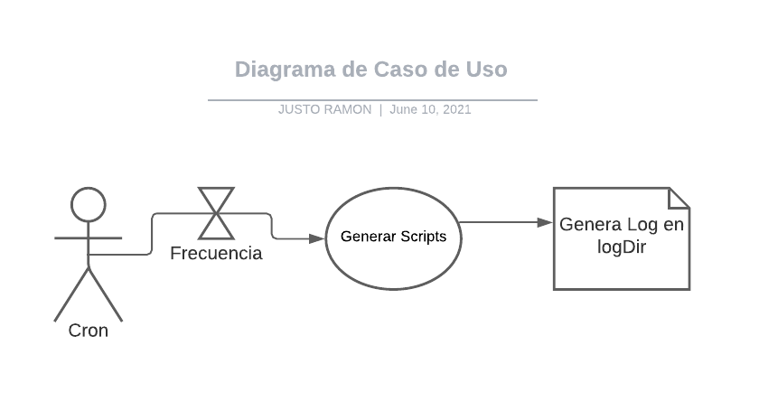

# Modulo PLANIFICACIÓN

En este modulo se observa o actualiza los eventos reservados acompañados de los servicios solicitados por el cliente o contacto, el tipo de evento, detalle del lugar, fecha y hora del evento. Estos datos se encuentran insertos en la BD de fotopy

## Caracteristicas del Sistema Informático para el gerenciamiento y control de eventos fotográficos de la Empresa «FOTO PRODUCCIONES»

Puede generar una cantidad casi ilimitada de datos, ya que los divide en partes, la cantidad de registros que puede importar es manualmente programable.
Puede integrar los XML que recibe, ya sea en el directorio del script o dentro del directorio configurable por el programador del sistema.

- _Sin límites_

El sistema manejará cada dato generado correctamente y le permitirá importar datos de manera selectiva en formatos permitidos por el sistema a su escritorio.

- _Universal_

Es compatible con los archivos XML generados correctamente. La única condición es que el archivo contenga todos los datos requeridos por el sistema; p.ej. un nombre de producto o un código de combinación.
No tiene que preocuparse por la versión del sistema o la actualización planificada. ¡El sistema está preparado para ser responsive!

- _CRON - importaciones sin contacto_

El sistema genera la posibilidad para una importación directa (CRON) para cada archivo configurado en tiempo. Esto permite una automatización completa y al 100% de la importación y la situación en reporte.

- _Rápido y flexible_

El sistema usa el potencial de su servidor. Los módulos también admiten manipulación de datos para posteriormente ser importados o actualizados. 
El sistema funciona en servidores FTP clásicos y en máquinas potentes como VPS Linux y nubes como Google Cloud, AWS, entre otros.

## Instalación

- Este sistema es web por lo que no requiere instalación previa, se ejecuta desde cron o desde cualquier navegador web.

## Layout del sistema

Diagramado UML

## Diagrama del Caso de Uso General

- Se observa como influye el modulo situado en el ambiente del sistema, cuyos actores pueden ser tanto el cron, como el usuario que acceda desde el navegador.

## Caso de Uso del módulo específico

- En este caso se puede observar, que acorde a la frecuencia del cron, se ejecutan los scripts y generan la bitácora de resultados en el directorio.

## Diagrama de Flujo Gral del Algoritmo

- El procedimiento y flujo básico del módulo

## Información previa

- Todos los scripts generan bitácora, errorlog y algunos que lo requieren un oklog en el directorio /logDir/filename.txt
- Todos los scripts muestran informacion en pantalla de acuerdo a los resultados obtenidos
- Algunos scripts requieren la creación previa de tablas, el código para generar lo tiene cada scripts
- Todos los scripts se ejecutan 1 vez x dia, excepto el 8 y el 10 que lo hacen cada 12 y 14 minutos, recibe 2 xml

## Parametros y Configuracion

- El script 4 borra la tabla ps_category_product antes de ser generado, a solicitud del Cliente
- Configurar la variable $ExecInLocalServer = TRUE; //es true si el script se ejecuta en el mismo server donde estan los archivos, no usara ftp
- Lista de directorios donde el script busca por \*.xml, si hay mas de 1 lo procesa por orden alfabetico
- Si hay mas de 1000 imagenes nuevas o es una nueva importacion, el script 12, debe correrse en forma incremental de 100 en 100, para no colgar el server
- El script 15 pide parametros, segun el cliente, puede haber hasta 10, formato reference_1.jpg

## Directorios y Processed

- $remote_dir1 = '../../files/NavigationTree/'; // Script 1 y 4. el 4 lo pasa a processed
- $remote_dir2 = '../../files/Products/'; //script 2,3, 5 y 6 el 6 lo pasa a processed
- $remote_dir4 = '../../files/ProductRates/'; script 7 y 9, el 9 lo pasa a processed
- $remote_dir3 = '../../files/Inventory/'; // script 8 y 10 el 10 lo pasa a processed

## Acceso desde Navegador

- 
La url de acceso desde navegador a los scripts es <a href="https://partyfiesta.com/es/es/wim_partyfiestaxmlimporter/">https://partyfiesta.com/es/es/wim_partyfiestaxmlimporter/</a>

## Regresar a los scripts

- [Ir al inicio ](../../)
